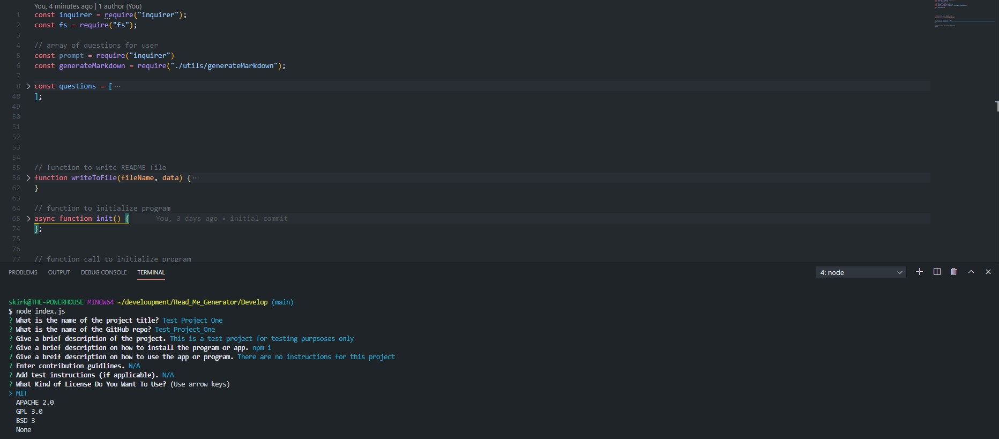

# Read Me Generator

   




## Description
This is a README file and template generator. This program accepts user input and creates a README.md file complete with license badge and description. The project uses Node.js as well as inquirer npm package. This README was generated using this program. 
## Table of Contents 
  - [Installation](#installation)
  - [Usage](#usage)
  - [Contributing](#contributing)
  - [Tests](#tests)
  - [Questions](#questions)
  - [License](#license)
## Installation
To install necessary dependencies, run the following command:
``` 
npm i or npm install
```
## Usage
Open a terminal at the "index.js" file. Make sure to insatll all necessary npm packages using the installation command in the above "Installation" section. Enter command "node index.js" and enter question information. Choose the license used. And the program generates a file with the project title followed by "_README.md" ("Your_Project_Here_README.md"). Check the example photo of a test project in the assets folder.
## Contributing
I am the sole contributor currently.
## Tests
To run tests, run the following command:
```
N/A
```
## Questions
If you have any questions about the repo, open an issue or contact me directly at Skirkp18@gmail.com. You can find more of my work on [GitHub](https://github.com/Skirkp18).
## License
MIT License

Copyright (c) 2020 Skirkp18

Permission is hereby granted, free of charge, to any person obtaining a copy
of this software and associated documentation files (the "Software"), to deal
in the Software without restriction, including without limitation the rights
to use, copy, modify, merge, publish, distribute, sublicense, and/or sell
copies of the Software, and to permit persons to whom the Software is
furnished to do so, subject to the following conditions:

The above copyright notice and this permission notice shall be included in all
copies or substantial portions of the Software.

THE SOFTWARE IS PROVIDED "AS IS", WITHOUT WARRANTY OF ANY KIND, EXPRESS OR
IMPLIED, INCLUDING BUT NOT LIMITED TO THE WARRANTIES OF MERCHANTABILITY,
FITNESS FOR A PARTICULAR PURPOSE AND NONINFRINGEMENT. IN NO EVENT SHALL THE
AUTHORS OR COPYRIGHT HOLDERS BE LIABLE FOR ANY CLAIM, DAMAGES OR OTHER
LIABILITY, WHETHER IN AN ACTION OF CONTRACT, TORT OR OTHERWISE, ARISING FROM,
OUT OF OR IN CONNECTION WITH THE SOFTWARE OR THE USE OR OTHER DEALINGS IN THE
SOFTWARE.
